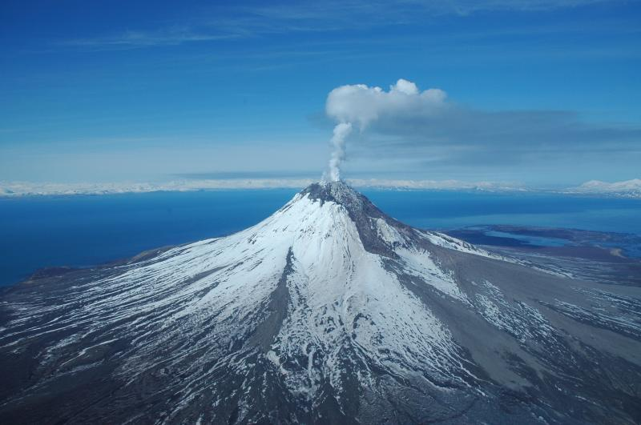
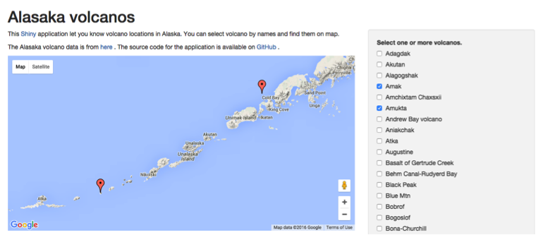

## Alasak volcano



--- 

## Introduction

1. Browsed data from Data.gov and found this Alaska volcano dataset
2. Data downloaded from https://www.avo.alaska.edu/volcanoes/latlong.php
3. 137 volcanos 

```{r }
# read data
load('/Users/YC/github/DevPro-week4/ak.rda')
head(ak$Volcano)
```

--- 

## Data

```{r }
# locatoin in longitude and latitude.
head(ak)
```

---

## App interface
 
1. Select volcanos of interest to see them on map.
2. Available at https://arcadianlyric.shinyapps.io/DevPro-week4/



