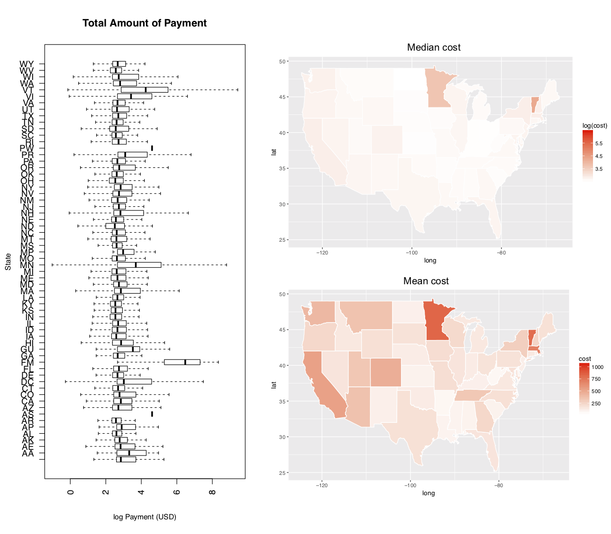
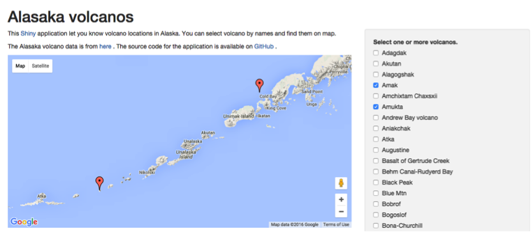
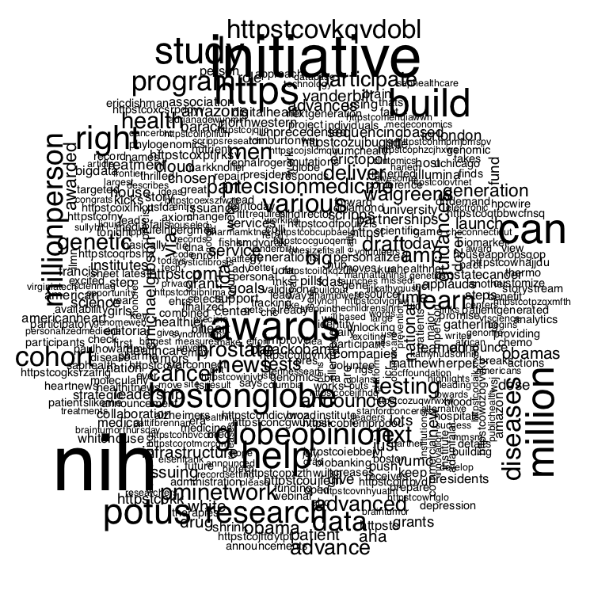
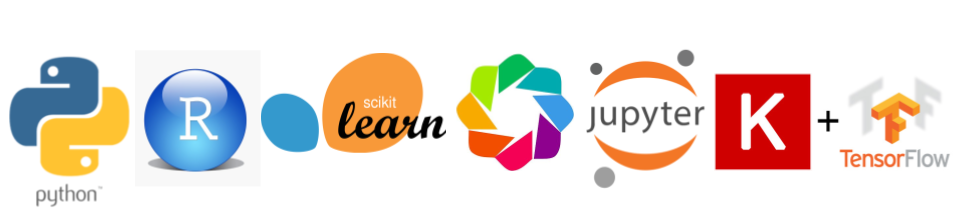

### side_projects
* healthcare open payment data mining, a Insight hackathon, get-better-with-data (2015):  
processed 6GB data of 10 million open payment records from Centers of Medicare & Medical Services (CMS), found states with significant high medical payments  

* volcano map Alaska (2016):  
interactive geographic location of volcanos with Rshiny UI  

* twitter API data mining (2016): 
studied public awareness of precision medicine, data cleaning (emotion emoji etc.), made word cloud  
most co-accurance words are NIH, government initiatives etc., limited public and biotech industry awareness at 2016   

* hadoop hive Yelp review (2017): 
mined 4million Yelp review to find coolest restaurants for recommendation  

  
 

 
