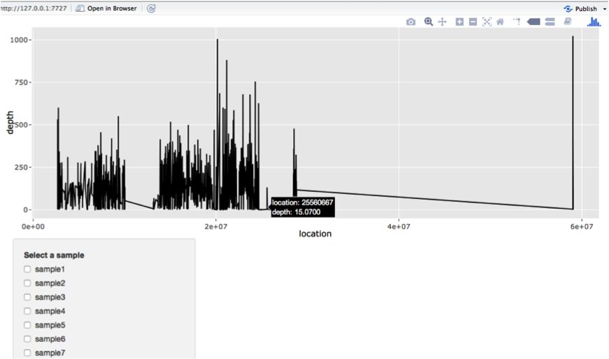

### This is a early dada challenge project to detect aneuploidy.  

Results include:  
1. [PPT presentation](https://docs.google.com/presentation/d/1TNzuQazoKBRPGsZXm4wE23Wo-F6YJVg5bBBZjwY2Ftg/edit?usp=sharing), report in .html  
2. code in .Rmd  
3. a Rshiny app for interactive visualization, show values on hover  
open runShiny.R and follow instruction  

### Description 
Aneuploidy is defined as presence of an abnormal number of chromosomes in a cell. We perform this test as part of our fertility panel.  

We provided data of two batches (batch_1, batch_2) that include a number of samples with this abnormality. The objective of this data challenge is to estimate the number of X and Y chromosomes for each sample.  

Each batch includes two files:  

Depth:  
This file has the average depth of each interval for each sample.  

Interval_order:  
This file has chromosome, start and end of the intervals in ‘Depth.csv’. The order of the rows in ‘Interval_order.csv’ file is the same as the order of the rows in ‘Depth.csv’ file in a given batch. Note that chromosomes X and Y are indexed as 23 and 24, respectively.  

