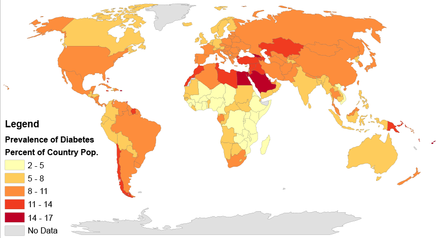
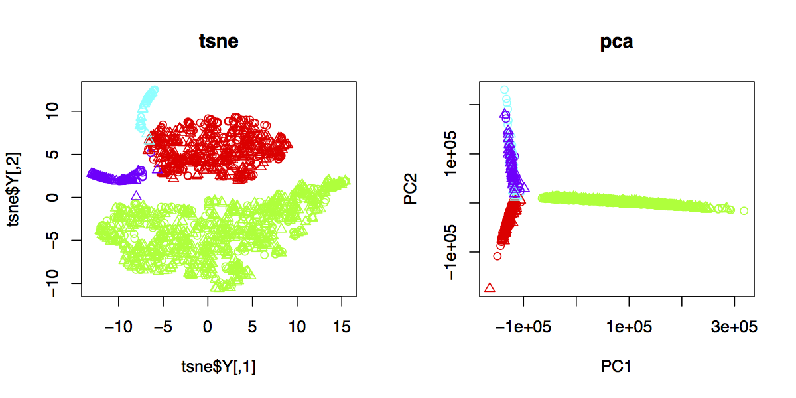
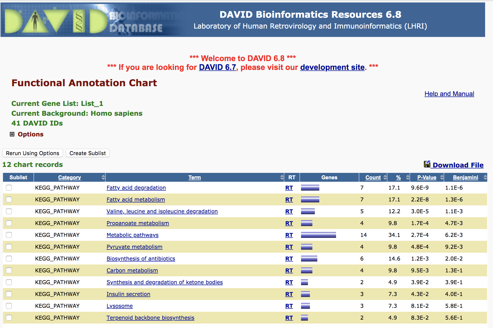

## Predict Type2 diabetes with islet single cell NGS data

### Introduction
[Type2 diabetes](https://en.wikipedia.org/wiki/Diabetes_mellitus_type_2), an aging related disease, is a long-term metabolic disorder that is characterized by high blood sugar, insulin resistance, and relative lack of insulin.  
There is an increase of the disease for the past decades and this increase is believed to be primarily due to the global population aging, a decrease in exercise, and increasing rates of obesity. The five countries with the greatest number of people with diabetes as of 2000 are India having 31.7 million, China 20.8 million, the United States 17.7 million, Indonesia 8.4 million, and Japan 6.8 million. It is recognized as a global epidemic by the World Health Organization.  

[RNA-sequencing](https://en.wikipedia.org/wiki/RNA-Seq) uses next-generation sequencing [NGS](https://en.wikipedia.org/wiki/Massive_parallel_sequencing) to reveal the presence and quantity of RNA in a biological sample at a given moment. Expression is quantified to study cellular changes in response to external stimuli, differences between healthy and diseased states, and other research questions.  

I've been study aging related disease such as cancer, so using Machine learning and genomics data to predict disease thus to get insight of molecular mechanism if of particular interest. 

  
### Material and Methods
#### Data
A public data set from [GEO](https://www.ncbi.nlm.nih.gov/geo/query/acc.cgi?acc=GSE81608), with ~1,600 single islet cell RNA-sequencing on people with and without Type2 diabetes.
#### Methods  
1. EDA with R, t-SNE outperform PCA on separating cells of different origin (alpha, beta cells etc.)  

2. Due to the high dimensionality of genes (~30,000), I extracted top 500 feature genes with high PCA loading for model training. 

### Results and Conclusion
1.Trained ensemble model of SVM, RandomForest XGB and Keras, result in a average corss validation accuracy of 0.88 and AUC > 0.95, which is not bad for biological data with limited samples  
2.Diverse model ensemble with diverse models only slightly improved accuracy, perhaps because different models all picked same strong predictors hence adding different modele together did not improve performance  
3.Neural network is not a best perfomer in this case, perhaps more training data are needed  
4.Top important genes enriched in metabolic pathways (Metabolic pathways, Pyruvate metabolism etc.), the signature genes seem to be more as results of the disease, not causal ones.  

#### Visualization
kmean clustering on heatmap, diff between disease and healthy ?  
interactive RUC with bokeh  
  

#### TODO: validate model and signature genes with independent data sets