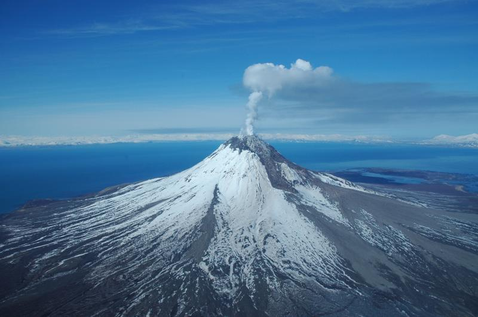

## Alasak volcano



--- 

## Introduction

1. Browsed data from Data.gov and found this Alaska volcano dataset
2. Data downloaded from https://www.avo.alaska.edu/volcanoes/latlong.php
3. 137 volcanos 


```r
# read data
load('/Users/YC/github/DevPro-week4/ak.rda')
head(ak$Volcano)
```

```
## [1] "Adagdak"            "Akutan"             "Alagogshak"        
## [4] "Amak"               "Amchixtam Chaxsxii" "Amukta"
```

--- 

## Data


```r
# locatoin in longitude and latitude.
head(ak)
```

```
##   VolcNameID            Volcano Latitude Longitude Datum
## 1         52            Adagdak 51.99050 -176.5852 WGS84
## 2         60             Akutan 54.13308 -165.9855 WGS84
## 3        128         Alagogshak 58.15730 -155.4000 WGS84
## 4         33               Amak 55.41728 -163.1469 WGS84
## 5        296 Amchixtam Chaxsxii 51.84750  179.8297 WGS84
## 6         20             Amukta 52.49419 -171.2548 WGS84
##                   loc                                    detail
## 1   51.9905:-176.5852            Adagdak at 51.9905 : -176.5852
## 2 54.13308:-165.98555           Akutan at 54.13308 : -165.98555
## 3      58.1573:-155.4            Alagogshak at 58.1573 : -155.4
## 4 55.41728:-163.14687             Amak at 55.41728 : -163.14687
## 5   51.8475:179.82972 Amchixtam Chaxsxii at 51.8475 : 179.82972
## 6 52.49419:-171.25476           Amukta at 52.49419 : -171.25476
```

---

## App interface
 
1. Select volcanos of interest to see them on map.
2. Available at https://arcadianlyric.shinyapps.io/DevPro-week4/


