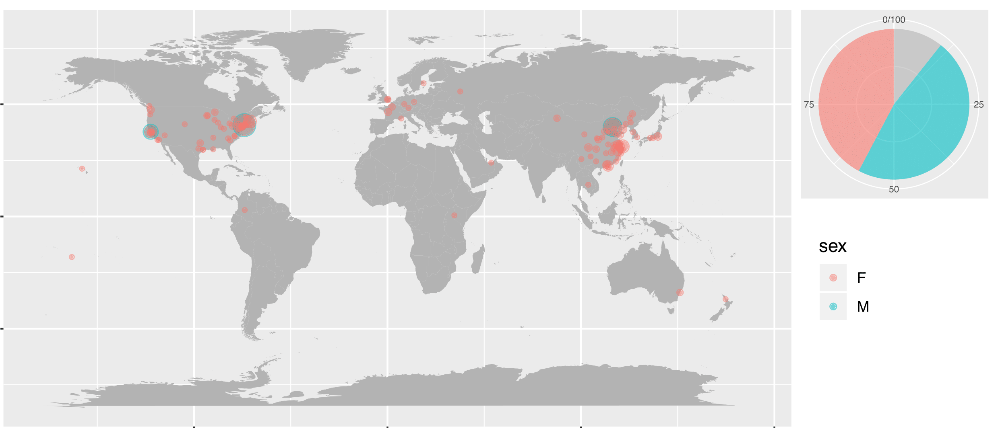

### Introduction 
WeChat, similar to Fackbook, is the dominant multi-purpose social media app in China. A lot can be revealed by one's WeChat social circle. Here I explored mine just for fun. Some details removed due to privacy concerns.

### Questions:   
1. While rooted in Beijing, I've spent years in New York, do I have more friends here or in hometown ?  
2. It says there's a gender imbalance: more girls in New York and vice versa in the West coast, dose that also apply to my data ?  

